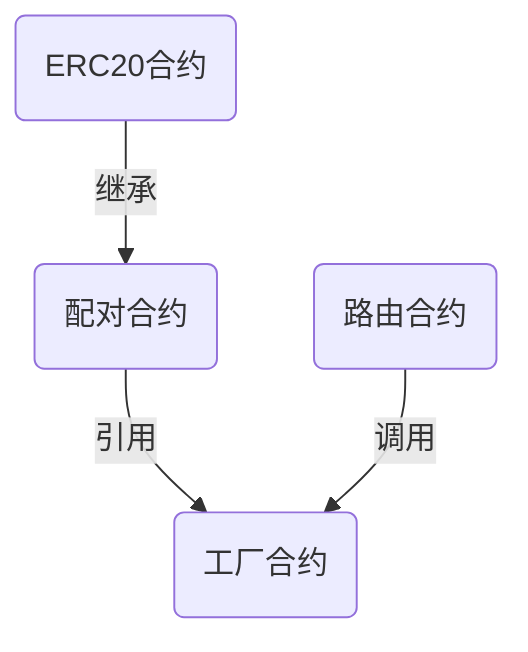

# 部署Uniswap v2交易所

## 清单
合约部分：

	这里使用工厂合约和路由合约02的在浏览器中验证的版本。
- [工厂合约](https://cn.etherscan.com/address/0x5C69bEe701ef814a2B6a3EDD4B1652CB9cc5aA6f#code)

0xE541b2a1f5fBf481ab42987CEdD27a6722E88885

- [weth](https://cn.etherscan.com/address/0xC02aaA39b223FE8D0A0e5C4F27eAD9083C756Cc2#code)

0xc4605BFBdFc7963b64230C439B93D73881Edf5A9

- [路由合约02](https://cn.etherscan.com/address/0x7a250d5630b4cf539739df2c5dacb4c659f2488d#code)

0x958bab8040B39fC24b9F324fA1030B90Bf6f5743

- [multicall合约](https://cn.etherscan.com/address/0x5e227ad1969ea493b43f840cff78d08a6fc17796#code)

0x255B4E90974C6488c65E8311A48F565e90c1F65b

自发行的ERC20 token：
0xD80d47F679107Ba47C5190fc544cA758F432e3D7


前端部分：

	目前v3,v2的前端已合并，为了避免出现问题，选用只支持v2的老版本
[uniswap-interface](https://github.com/Uniswap/interface/tree/b8c383c20e1a9d2cf29d8becce3e31b69219f1f8)

[uniswap-sdk](https://github.com/Uniswap/v2-sdk/tree/00a1eca9456d37c3d467f56e57a0496d1bf28e40)


## 步骤

### 1. 准备Uniswap合约源码

### 1.1 源码结构


> Uniswap v2在Github上面开源了全部合约代码,其中包括`核心合约`,`周边合约`两部分.
>
> Uniswap还开源了前端代码,前端代码使用React开发


- [核心合约](https://github.com/Uniswap/uniswap-v2-core)


- [周边合约](https://github.com/Uniswap/uniswap-v2-periphery)


- [前端代码](https://github.com/Uniswap/uniswap-interface)


> 在Uniswap的核心代码中,主要包含3个合约:`工厂合约`,`配对合约`,`ERC20合约`.其中配对合约继承了ERC20合约,我们可以把它们看作一个合约.工厂合约通过`create2`方法部署配对合约,所以在部署合约时`只需要部署工厂合约`.


> 周边合约中包括一些示例代码,例如价格预言机,闪电交换,其中最重要的是`路由合约`.在周边合约的代码库中,包含两个`路由合约`:`UnsiwapV2Router01`,`UnsiwapV2Router02`.工厂合约和配对合约需要通过路由合约调用才能更好的完成交易所的全部功能,所以我们`还要部署路由合约`





### 从浏览器中下载合约源码


> 如果你对合约代码并不熟悉,也可以跳过上面这部分,接下来我们将从以太坊浏览器中直接拷贝线上版合约源码


- [工厂合约](https://cn.etherscan.com/address/0x5C69bEe701ef814a2B6a3EDD4B1652CB9cc5aA6f#code)

- [路由合约02](https://cn.etherscan.com/address/0x7a250d5630b4cf539739df2c5dacb4c659f2488d#code)


## 部署合约


### 准备部署账户


> Uniswap的路由合约部署在以太坊的主网和几个测试网的`合约地址都是相同的`,这样可以使Uniswap的前端不管切换到任何一个网络,路由地址都不会变.要想实现这个相同地址的部署,最简单的方式,准备一个`全新的账户`用来部署合约.全新的账户指的是在部署合约之前的`nonce值为0`.因为合约的地址是根据你的账户地址和nonce值计算出来的,所以在不同网络中,如果nonce值相同,部署出的合约地址也相同.


#### 通过助记词生成新账户
> 生成好助记词之后,记得用英文助记词,保存好助记词,还有助记词对应的账户地址


#### 向新地址转帐ETH


> 通过一个已有Ether的账户向新账户转帐.测试网的Ether可以通过每个测试网的水龙头申请到测试币.


> 转账完成后,将助记词导入到Metamask中


### 使用remix部署合约

> 将工厂合约和路由合约的线上版本导入到remix中,在编译合约的选项中,EVM VERSION选择`istanbul`,COMPILER CONFIGURATION中选择`Enable optimization`


### 部署顺序和构造函数

1. 部署WETH合约

2. 部署工厂合约
    - 修改工厂合约，在UniswapV2Factory合约中增加获取pair合约创建hash值的
```solidity
bytes32 public constant INIT_CODE_PAIR_HASH = keccak256(abi.encodePacked(type(UniswapV2Pair).creationCode));
```
	- 构造函数的参数是一个自己常用的账户地址
3. 部署路由合约02
   	- 修改路由合约02，修改UniswapV2Library.pairFor方法中init code hash值为，上一步部署的工厂合约后获取的INIT_CODE_PAIR_HASH值，注意： 需去掉0x
	- 构造函数的参数1是工厂合约的地址
	- 参数2 是当前网络中WETH合约的地址, 此处用第1步中部署的WETH合约地址


## 部署Uniswap前端
## v2-sdk
### 下载SDK代码
[uniswap-sdk](https://github.com/Uniswap/v2-sdk/tree/00a1eca9456d37c3d467f56e57a0496d1bf28e40)

### 下载依赖包
#### v2-sdk所在目录打开命令行输入:
`yarn`

#### 修改SDK代码

##### 新增ChainId: `项目目录/v2-sdk/src/constants.ts`, 第6行, 新增Sepolia网络Id
```javascript
export enum ChainId {
  ...
  SEPOLIA = 11155111
}
```
##### 修改INIT_CODE_HASH: `项目目录/v2-sdk/src/constants.ts` 第27行, 修改为工厂合约地址
##### 修改INIT_CODE_HASH: `项目目录/v2-sdk/src/constants.ts` 第29行, 修改为工厂合约部署后获取的INIT_CODE_PAIR_HASH
##### 新增WETH地址: `项目目录/v2-sdk/src/entities/token.ts` 第59行, WETH变量新增Sepolia网络
```javascript
export const WETH = {
  ...
  [ChainId.SEPOLIA]: new Token(
    ChainId.SEPOLIA,
    '0xc4605BFBdFc7963b64230C439B93D73881Edf5A9', // 修改为上述部署的WETH地址
    18,
    'WETH',
    'Wrapped Ether'
  )
}
```
### 上传包
#### 修改包名
`项目目录/v2-sdk/package.json`， 第2行， 注意： @表示私有仓库，需开通。普通用户只能上传到公共仓库。
```javascript
{
  "name": "XXXuniswap-sdk",
  "license": "MIT",
  "version": "1.0.0",
  ...
}
```
#### 修改版本号（可不改）
`项目目录/v2-sdk/package.json`， 第4行

#### 登录npm
> v2-sdk所在目录运行命令:
`npm login`

#### 上传
> v2-sdk所在目录运行命令:
`npm publish`

## uniswap-interface
### 下载前端代码

- [前端代码](https://github.com/Uniswap/uniswap-interface)

### 下载依赖包
> uniswap-interface所在目录运行命令:
`yarn`

### 修改uniswap-interface代码
#### 删除@uniswap/sdk依赖
`yarn remove @uniswap/sdk`
#### 添加自己的sdk依赖
`yarn add wildpiggeruniswap-sdk`
#### 替换@uniswap/sdk依赖，替换项目中所有的@uniswap/sdk为自己的sdk依赖
#### 修改路由合约地址， 修改文件: `项目目录/src/constants/index.ts` 第6行

#### 增加multicall地址， 修改文件: `项目目录/src/constants/multicall/index.ts`

```javascript
const MULTICALL_NETWORKS: { [chainId in ChainId]: string } = {
  ...
  [ChainId.SEPOLIA]: '0x255B4E90974C6488c65E8311A48F565e90c1F65b'
}
```
#### 增加WETH地址映射, 修改文件`项目目录/src/constants/index.ts`
```javascript
const WETH_ONLY: ChainTokenList = {
  ...
  [ChainId.SEPOLIA]: [WETH[ChainId.SEPOLIA]]
}

```
#### 增加NETWORK_LABELS，修改文件`项目目录/src/components/Header/index.tsx`
```javascript
const NETWORK_LABELS: { [chainId in ChainId]: string | null } = {
  ...
  [ChainId.SEPOLIA]: 'Sepolia'
}


```
#### 增加V1_FACTORY_ADDRESSES，修改文件`项目目录/src/constants/v1/index.ts` ，注： 由于没有部署v1的工厂合约，因此留空即可
```javascript
const V1_FACTORY_ADDRESSES: { [chainId in ChainId]: string } = {
  ...
  [ChainId.SEPOLIA]: ''
}

```
#### 增加hooks中EMPTY_LIST， 修改文件`项目目录/src/state/lists/hooks.ts`
```javascript
const EMPTY_LIST: TokenAddressMap = {
  ...
  [ChainId.SEPOLIA]: {}
}

```

#### 增加CHAIN_ID_NETWORK_ARGUMENT, 修改文件`项目目录/src/connectors/Fortmatic.ts`
```javascript
const CHAIN_ID_NETWORK_ARGUMENT: { readonly [chainId in FormaticSupportedChains]: string | undefined } = {
  ...
  [ChainId.SEPOLIA]: 'Sepolia'
}

```

#### 增加supportedChainIds, 修改文件`项目目录/src/connectors/index.ts`
```javascript
export const injected = new InjectedConnector({
  supportedChainIds: [1, 3, 4, 5, 42, 11155111]
})

```

#### 修改BAD_RECIPIENT_ADDRESSES， 修改文件`项目目录/src/state/swap/hooks.ts`, 修改成自己部署的地址， 未部署v1 router，留空即可
```javascript
const BAD_RECIPIENT_ADDRESSES: string[] = [
  '0x5C69bEe701ef814a2B6a3EDD4B1652CB9cc5aA6f', // v2 factory
  '', // v2 router 01
  '0x7a250d5630B4cF539739dF2C5dAcb4c659F2488D' // v2 router 02
]

```


#### 删除修改多余tokenlist `项目目录/src/constants/lists.ts` , 保留DEFAULT_TOKEN_LIST_URL， 其余删除
```javascript
export const DEFAULT_TOKEN_LIST_URL = 'tokens.uniswap.eth' // 修改成自己的tokenlist地址

export const DEFAULT_LIST_OF_LISTS: string[] = [
  DEFAULT_TOKEN_LIST_URL,
]
```
#### 增加浏览器连接，`项目目录/src/utils/index.ts`，修改浏览器映射
```javascript
const ETHERSCAN_PREFIXES: { [chainId in ChainId]: string } = {
	1: '',
	3: 'ropsten.',
	4: 'rinkeby.',
	5: 'goerli.',
	42: 'kovan.',
	11155111: 'sepolia.'
}
```
### 本地运行测试
`yarn start`

### 将代码部署到GitHub Pages

#### 创建GitHub项目

#### 代码添加到GitHub项目仓库

#### 安装并部署gh-pages
> 我们将通过gh-pages模块将前端代码部署到github.io,在前端代码的目录运行:

```
$ yarn add gh-pages
```


> 接下来要编译react和部署gh-pages,在前端代码的目录运行:


```
$ yarn build
```

> 修改前端代码目录中的package.json

```
$ vim package.json
```

```
{
  "name": "@uniswap/interface",
  "description": "Uniswap Interface",
  "homepage": "https://用户名.github.io/项目名称",//修改这里
......

// 添加部署的脚本,还是在package.json中
......
"scripts": {
    ......
    "deploy": "gh-pages -d build" //添加这一行
  },
```

> 保存退出之后,在前端代码的目录运行:

```
$ git add .
$ git commit -m "first commit"
$ git push
$ yarn deploy
```

> 现在在浏览器中打开`https://用户名.github.io/项目名称/index.html`就可以打开自己的交易所啦.

> 如果不输入地址结尾的index.html在项目刚部署之后会报错,过一段时间就可以不输入了.


## 扩展

### 部署自己的weth

> 可以将以太坊浏览器中的weth源码拷贝下来,自己部署一个属于自己的weth合约

### 可信token列表

> Uniswap有一个自己的可信token列表,同样被设置在`项目目录/uniswap-interface/src/constants/index.ts`文件中,在最后一行就是.你可以将这个链接地址的文件拷贝下来,设置成自己需要的可信token地址列表,然后上传到github目录中,再修改index.ts文件中的链接地址,这样就可以让你自己的交易所中拥有自己设置的可信token列表了